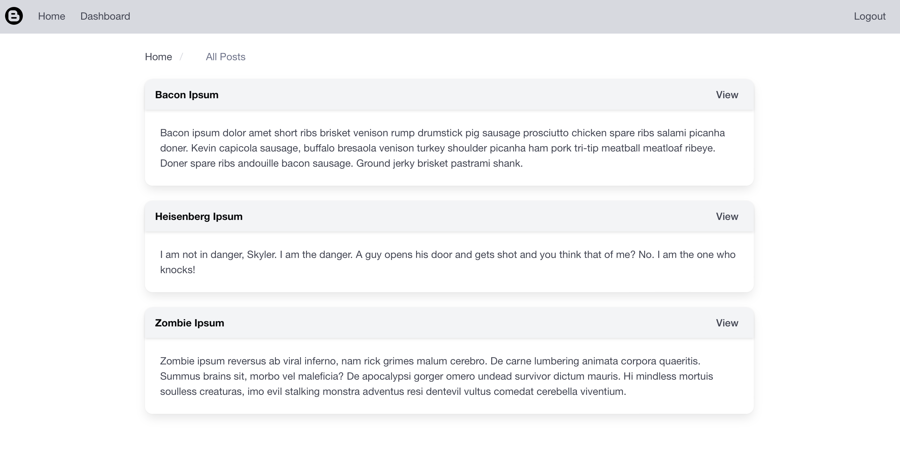

# Tech Blog

[](https://opensource.org/licenses/MIT)

## Description

A CMS-style blot where developers can publish their posts and comment on each other's posts as well.

## Table Of Contents

- [Installation](#installation)
- [Usage](#usage)
- [License](#license)
- [Contributing](#contributing)
- [Tests](#tests)
- [Questions](#questions)

## Installation

1. Install by running `npm i` in the terminal.

2. If you would like to use the provided see data, feel free to run `npm run seed` in the terminal.

## Usage

### Initialize App From Terminal

```sh
npm start
```

### Screenshot



## License

This project is licensed under the MIT license.

## Contributing

We welcome contributions from the community to help improve this project. Please refer to the contribution guidelines here.

## Tests

Please run "npm test" if test scripts are defined in the package.json file.

## Questions

- Feel free to contact me on Github [rich-strain](https://github.com/rich-strain) or [richardstrain@gmail.com](mailto:richardstrain@gmail.com)
